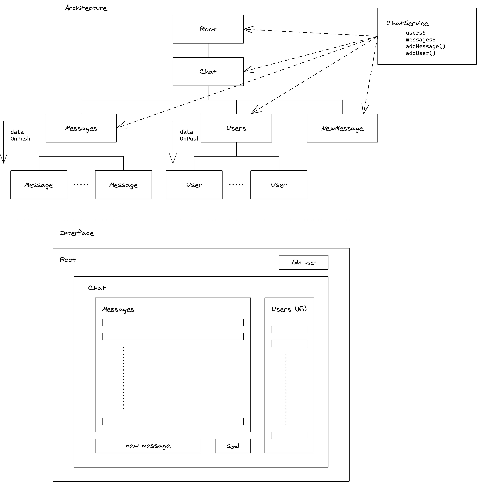

# TP : RXJS

Le but de ce TP est de mettre en place des services avec utilisation de RxJS. Nous utiliseons aussi le pipe async dans les composants.

## Prérequis

Vérifier la version d'Angular installée.

```
ng --version
```

Installer la dernière version si ce n'est pas à jour.

```
npm uninstall -g @angular-cli
npm install -g @angular/cli@latest
```

Générer un nouveau projet

```
ng new tp-rx
```
## Architecture cible



## Roles des composants

### Root

* Composant racine
* Affiche un bouton "add user" pour ajouter un user aléatoire.
* Fait appel à ChatService

### Chat

* Composant du chat
* Contient les sous composants Messages et Users
* Contient un champ de texte et un bouton pour nvoyer un message
* Fait appel à ChatService

### Messages

* Composant d'affichage de la liste des messages
* Contient des sous composants "Message"
* Fait appel à ChatService


### Message 

* Composant d'affichage d'un message
* Recoit le message via son Input
* Doit avoir la stratégie de détection OnPush

### Users

* Composant d'affichage de la liste des messages
* Contient des sous composants "User"
* Affiche le nombre de user
* Fait appel à ChatService

### User

* Composant d'affichage d'un User
* Reçoit le User via son Input.

## Travail à réaliser

* Générer les différents composants à l'aide de la ligne de commande `ng generate`
* Implémenter le service et les composants
    * Utiliser BehaviorSubject, ou signal dans le service
    * Utiliser le pipe `async` dans les composants
* Vérifier le bon fonctionnement de l'application 