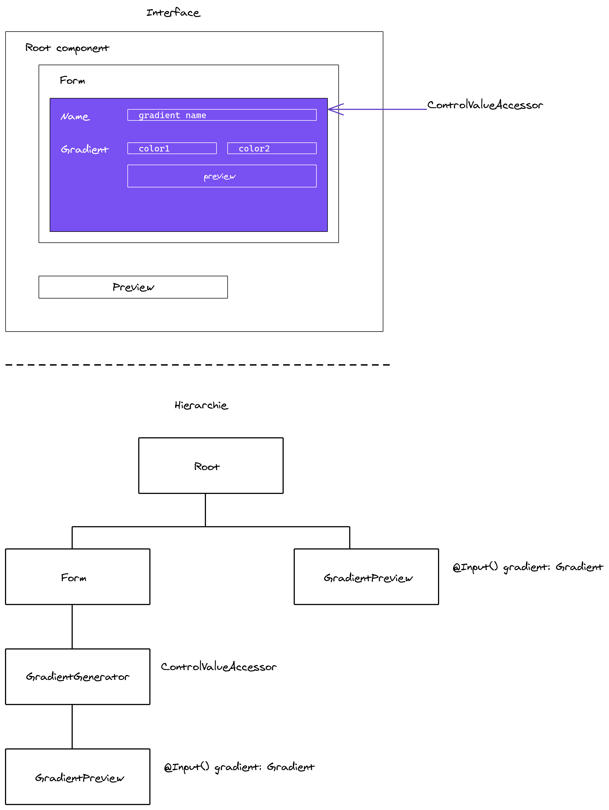

# TP CONTROLVALUEACCESSOR

Le but de ce TP est de créer son propre élément de formulaire réutilisable.

## Prérequis

Vérifier la version d'Angular installée.

```
ng --version
```

Installer la dernière version si ce n'est pas à jour.

```
npm uninstall -g @angular-cli
npm install -g @angular/cli@latest
```

Générer un nouveau projet

```
ng new tp-cva
```

## Architecture

Générer les différents composants de notre application pour réaliser cette architecture



## Spécification des différents composants/classes

## Gradient

Interface représentant un gradient entre deux couleurs.

```ts
interface Gradient {
    name: string;
    startColor: string;
    endColor: string;
}
```

### Root 

* Composant racine de l'application
* Contient un formulaire

### GradientChooser

* Composant principal de notre générateur de gradients
* Implémente l'interface CONTROLVALUEACCESSOR

### GradientPreview

* Composant de prévisualisation du gradient

Note, nous utiliserons cette css pour générer la preview, exemple :

```css
background: linear-gradient(0deg, #2A7B9B 0%, #EDDD53 100%);
```

## Bonus

Créer un composant de formulaire (CONTROLVALUEACCESSOR) pour récupérer un couple login/password. Mettre des contraintes : valeurs non vides.
