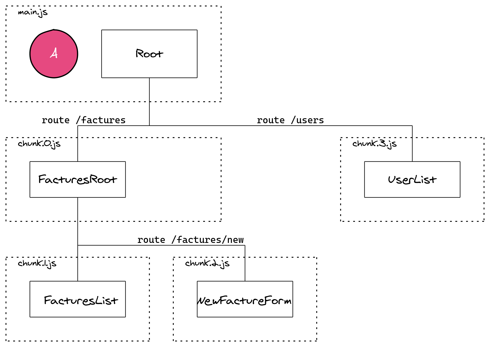

# TP Lazy Loading

Le but de ce TP est d'architecturer une application avec plusieurs sous modules en lazy loading.

## Prérequis

Vérifier la version d'Angular installée.

```
ng --version
```

Installer la dernière version si ce n'est pas à jour.

```
npm uninstall -g @angular-cli
npm install -g @angular/cli@latest
```

Générer un nouveau projet

```
ng new tp-lazy-loading
```

## Architecture

Générer les différents composants de notre application pour réaliser cette architecture



## Spécification des différents composants

### Root 

* Composant racine de l'application
* Affiche des liens vers les différentes routes

### FacturesRoot

* Composant racine des factures
* Affiche des liens vers les sous routes
* Charge par défaut la route vers la liste des factures

### FacturesList

* Composant d'affichage de la liste de factures
* Mettre de la donnée en dur directement dans le template

### NewFacture form

* Composant d'affichage d'un formulaire pour remplir une nouvelle facture

### UserList

* Composant d'affichage d'une liste d'utilisateurs
* Mettre de la donnée en dur directement dans le template

## Vérification du lazy loading

Depuis la console DevTools accéder à l'onglet Network et vérifier que les modules sont bien chargés à la demande.

Lancer la commande `ng build` et inspecter le dossier `dist`. Vérifier que les chunks ont bien été générés.

## Bonus: esbuilder-visualize

Lancer la commande `ng build --stats-json` et utiliser https://esbuild.github.io/analyze/ pour visualiser la répartition des chunks

